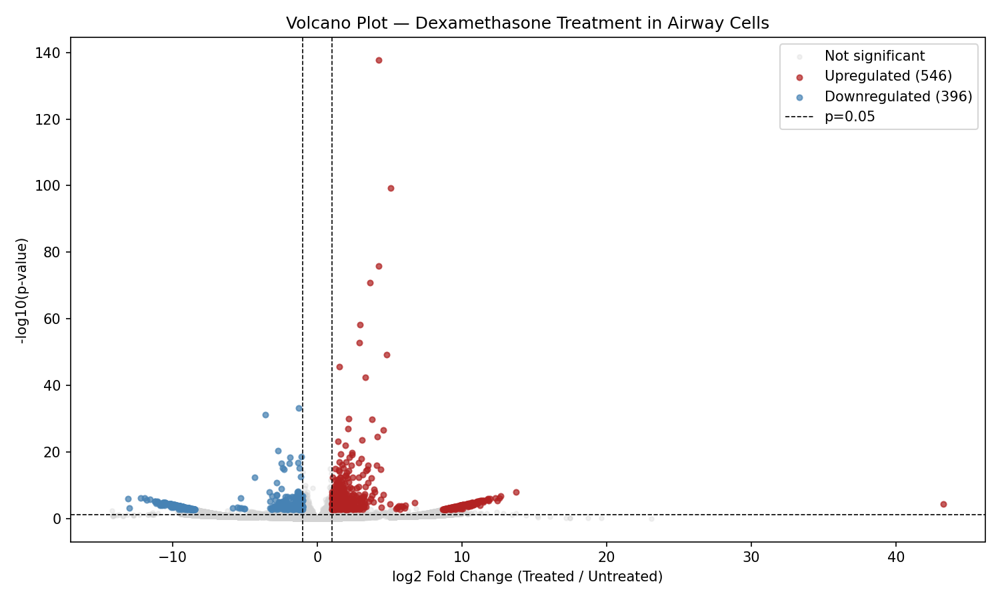
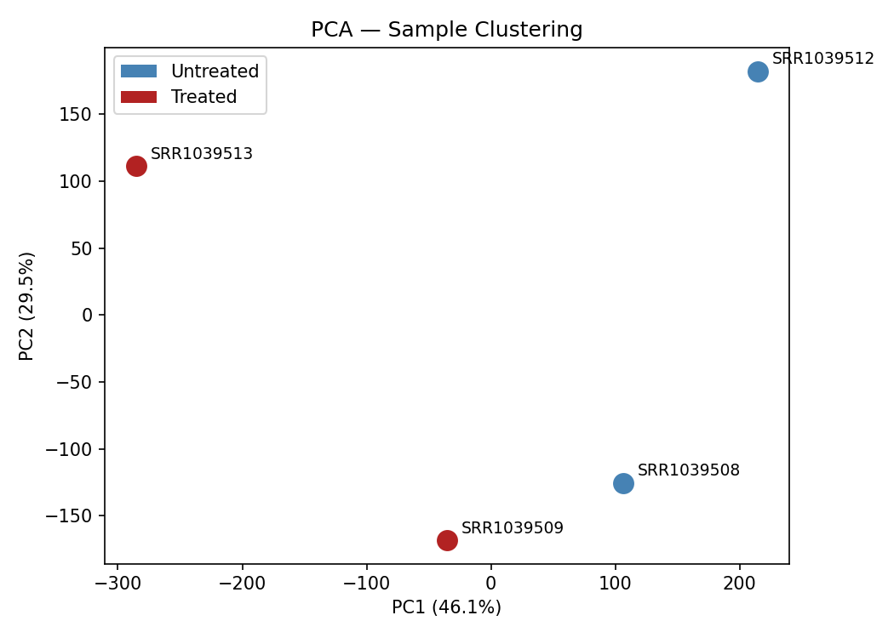
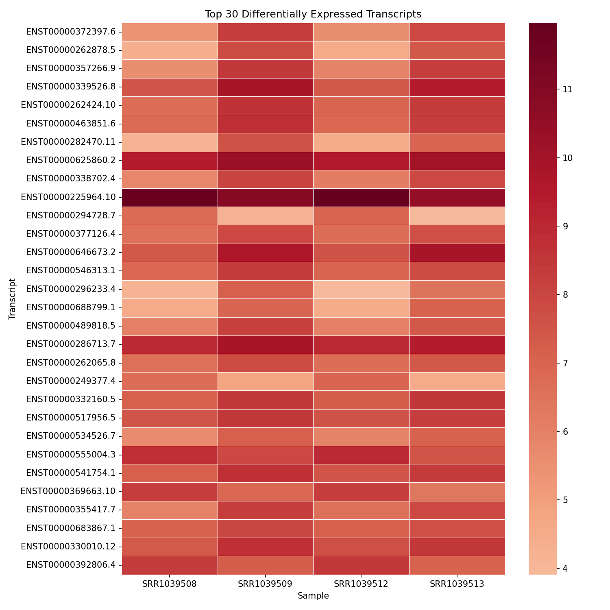

# RNA-seq Differential Expression Analysis

A reproducible RNA-seq pipeline for differential expression analysis of human airway cells treated with dexamethasone, using Salmon for transcript quantification, PyDESeq2 for statistical analysis, and biomaRt for gene annotation.

## Biological Context

This pipeline analyses the [airway dataset (SRP033351)](https://www.ncbi.nlm.nih.gov/sra/?term=SRP033351) — a well-established human RNA-seq experiment comparing airway smooth muscle cells treated with the glucocorticoid **dexamethasone** versus untreated controls.

Dexamethasone is a corticosteroid widely used to treat asthma, autoimmune conditions, and inflammatory disease (including COVID-19). The analysis identifies genes activated or suppressed by this drug in human airway cells.

## Pipeline Overview
```
FASTQ reads (ENA: SRR1039508, SRR1039509, SRR1039512, SRR1039513)
        ↓
Quality Control (FastQC)
        ↓
Transcript Quantification (Salmon)
        ↓
Differential Expression Analysis (PyDESeq2)
        ↓
Gene Annotation (R + biomaRt / Ensembl)
        ↓
Visualisation (volcano plot, PCA, heatmap)
```

## Tools & Technologies

| Tool | Version | Purpose |
|---|---|---|
| Salmon | 1.10.2 | Transcript quantification |
| PyDESeq2 | latest | Differential expression analysis |
| biomaRt | Bioconductor | Gene annotation via Ensembl |
| FastQC | latest | Quality control |
| Python | 3.13 | Data processing & visualisation |
| R | 4.3.3 | Gene annotation |
| pandas, numpy | latest | Data manipulation |
| matplotlib, seaborn | latest | Visualisation |
| scikit-learn | latest | PCA |

## Dataset

| Sample | Accession | Condition |
|---|---|---|
| Sample 1 | SRR1039508 | Untreated |
| Sample 2 | SRR1039509 | Dexamethasone treated |
| Sample 3 | SRR1039512 | Untreated |
| Sample 4 | SRR1039513 | Dexamethasone treated |

- **Organism:** Homo sapiens
- **Cell type:** Airway smooth muscle cells
- **Reference:** Ensembl GRCh38 release 109

## Repository Structure
```
rna-seq-differential-expression/
├── data/                          # FASTQ files (not tracked)
├── reference/                     # Salmon index (not tracked)
├── results/
│   └── de_analysis/
│       ├── de_results.csv         # Raw DESeq2 results
│       ├── de_results_annotated.csv  # Annotated with gene names
│       ├── top20_significant.csv  # Top 20 DE genes
│       ├── top_upregulated.csv    # Upregulated genes (546)
│       ├── top_downregulated.csv  # Downregulated genes (396)
│       ├── volcano_plot.png       # Volcano plot
│       ├── pca_plot.png           # PCA sample clustering
│       └── heatmap.png            # Top 30 DE genes heatmap
├── scripts/
│   ├── quantification_pipeline.sh  # Salmon quantification
│   ├── differential_expression.py  # PyDESeq2 analysis
│   └── annotate_genes.R            # biomaRt annotation
├── requirements.txt
└── README.md
```

## Results Summary

| Metric | Value |
|---|---|
| Total transcripts tested | 75,896 |
| Significant (padj < 0.05) | 1,125 |
| Upregulated (LFC > 1) | 546 |
| Downregulated (LFC < -1) | 396 |

## Key Findings

Top differentially expressed genes in response to dexamethasone treatment:

| Gene | Direction | log2FC | Biological Role |
|---|---|---|---|
| FKBP5 | ⬆ Upregulated | +5.06 | Classic glucocorticoid response gene |
| DUSP1 | ⬆ Upregulated | +4.26 | Anti-inflammatory phosphatase |
| TSC22D3/GILZ | ⬆ Upregulated | +4.23 | Key mediator of glucocorticoid effects |
| ZBTB16 | ⬆ Upregulated | +3.63 | Steroid-induced transcription factor |
| PER1 | ⬆ Upregulated | +2.94 | Circadian clock regulation |
| CRISPLD2 | ⬆ Upregulated | +4.80 | Anti-inflammatory airway response |

Results are consistent with known glucocorticoid biology, validating the pipeline's accuracy.

## Visualisations

### Volcano Plot


### PCA — Sample Clustering


### Heatmap — Top 30 DE Genes


## How to Reproduce

### 1. Clone the repository
```bash
git clone https://github.com/Ioannakiou/rna-seq-differential-expression
cd rna-seq-differential-expression
```

### 2. Set up Python environment
```bash
python3 -m venv rnaseq_env
source rnaseq_env/bin/activate
pip install -r requirements.txt
```

### 3. Install R dependencies
```r
install.packages("BiocManager")
BiocManager::install("biomaRt")
```

### 4. Download reference and build Salmon index
```bash
wget https://ftp.ensembl.org/pub/release-109/fasta/homo_sapiens/cdna/Homo_sapiens.GRCh38.cdna.all.fa.gz -P reference/
salmon index -t reference/Homo_sapiens.GRCh38.cdna.all.fa.gz -i reference/salmon_index --threads 4
```

### 5. Download data from ENA
```bash
cd data/
wget ftp://ftp.sra.ebi.ac.uk/vol1/fastq/SRR103/008/SRR1039508/SRR1039508_1.fastq.gz
wget ftp://ftp.sra.ebi.ac.uk/vol1/fastq/SRR103/008/SRR1039508/SRR1039508_2.fastq.gz
wget ftp://ftp.sra.ebi.ac.uk/vol1/fastq/SRR103/009/SRR1039509/SRR1039509_1.fastq.gz
wget ftp://ftp.sra.ebi.ac.uk/vol1/fastq/SRR103/009/SRR1039509/SRR1039509_2.fastq.gz
wget ftp://ftp.sra.ebi.ac.uk/vol1/fastq/SRR103/002/SRR1039512/SRR1039512_1.fastq.gz
wget ftp://ftp.sra.ebi.ac.uk/vol1/fastq/SRR103/002/SRR1039512/SRR1039512_2.fastq.gz
wget ftp://ftp.sra.ebi.ac.uk/vol1/fastq/SRR103/003/SRR1039513/SRR1039513_1.fastq.gz
wget ftp://ftp.sra.ebi.ac.uk/vol1/fastq/SRR103/003/SRR1039513/SRR1039513_2.fastq.gz
```

### 6. Run quantification
```bash
bash scripts/quantification_pipeline.sh
```

### 7. Run differential expression analysis
```bash
python scripts/differential_expression.py
```

### 8. Run gene annotation
```bash
Rscript scripts/annotate_genes.R
```

## Author

**Ioanna Kiourti**
MSc Bioinformatics & Computational Biology
[GitHub](https://github.com/Ioannakiou)
